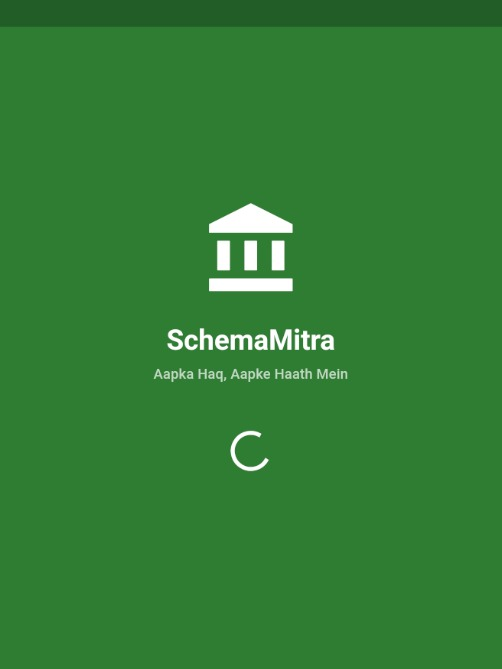
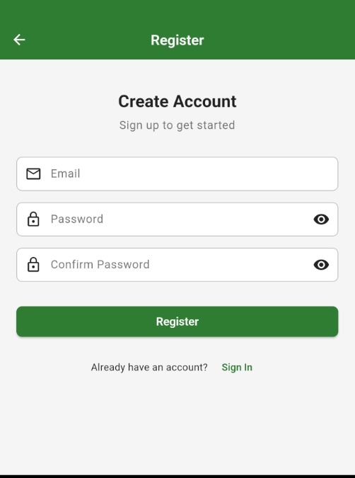
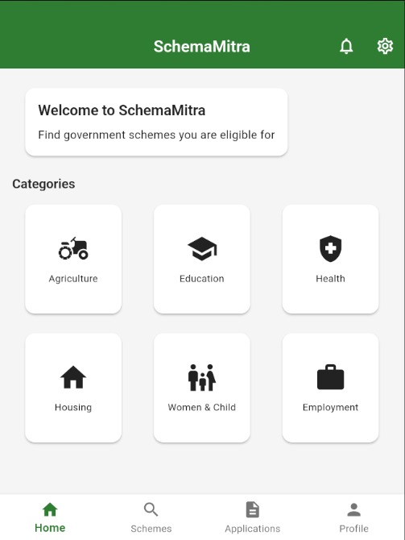
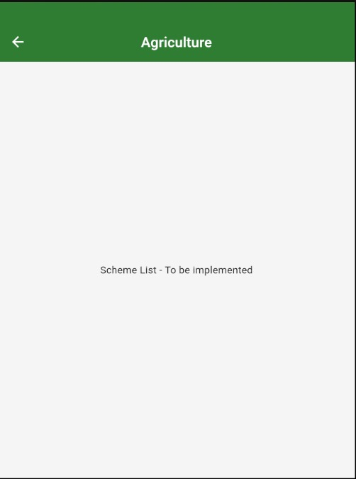
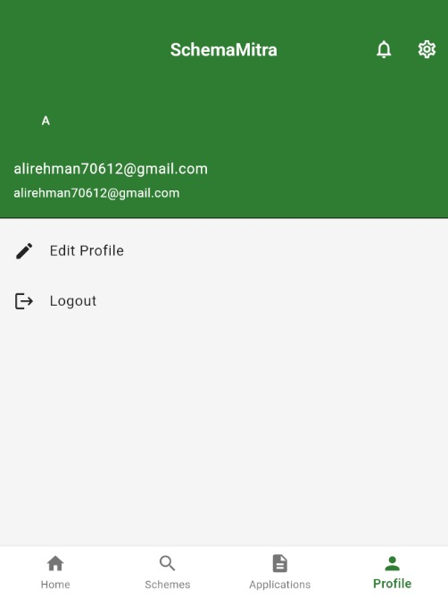
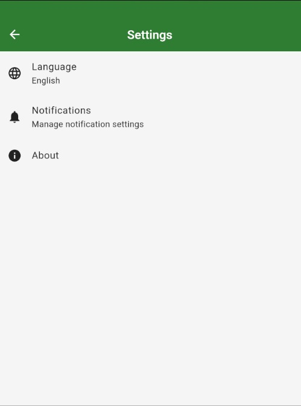

# Yojna Sathi - Government Scheme Eligibility & Application Flutter App


**Tagline:** Aapka Adhikaar, Aap Tak

A comprehensive Flutter mobile application that enables Indian citizens to discover, match, and apply for central and state government schemes. The app features personalized profile creation, automatic eligibility matching, direct application options, offline browsing, new scheme notifications, and tutorial guides.

## 📱 Features

- **User Authentication**: Email, Phone, and Google sign-in options
- **Profile Management**: Create and manage detailed user profiles with photo upload
- **Scheme Discovery**: Browse 41+ government schemes across 9 categories
- **Personalized Recommendations**: "For You" section with intelligent matching that auto-refreshes
- **Eligibility Matching**: Strict mandatory criteria checking with real-time updates including:
  - Gender-based filtering (Male/Female/Transgender specific schemes)
  - Age range validation
  - Category matching (General, SC, ST, OBC, etc.)
  - Occupation, State, Education, Income requirements
  - Match score calculation (0-100%)
- **Eligibility Badges**: Visual indicators (Highly Eligible 90%+, Eligible 70%+)
- **Application Tracking**: Apply for schemes and track application status
- **Document Upload**: Upload required documents for applications
- **Tutorial Videos**: Step-by-step guides for scheme applications
- **Search & Filter**: Advanced search with category and eligibility filters
- **Notifications**: Get notified about new schemes
- **Multi-language**: Support for Hindi and English (in development)

## 🏗️ Tech Stack

- **Frontend**: Flutter (Dart)
- **State Management**: BLoC Pattern with persistent state management
- **Backend**: Firebase
  - Authentication
  - Cloud Firestore
  - Cloud Storage (for profile photos)
  - Cloud Messaging (FCM)
- **Image Handling**: image_picker, cached_network_image
- **Local Storage**: Hive
- **Architecture**: Clean Architecture with feature-based structure

## 📁 Project Structure

```
lib/
├── config/
│   ├── routes/          # App routing configuration
│   └── theme/           # Theme and styling
├── core/
│   ├── di/              # Dependency injection
│   ├── services/        # Core services (eligibility, storage)
│   └── utils/           # Constants and utilities
├── features/
│   ├── auth/            # Authentication feature
│   ├── profile/         # User profile management
│   ├── schemes/         # Scheme browsing and details
│   ├── applications/    # Application management
│   ├── tutorials/       # Tutorial videos
│   ├── notifications/   # Push notifications
│   ├── settings/        # App settings
│   ├── home/            # Home dashboard
│   └── splash/          # Splash screen
└── main.dart            # App entry point
```

## 🚀 Getting Started

### Prerequisites

- Flutter SDK (>=3.24.5)
- Dart SDK (>=3.5.0)
- Android Studio / VS Code with Android SDK
- Node.js (for Firebase CLI)
- Firebase account

### Installation

1. **Clone the repository**
   ```bash
   git clone <repository-url>
   cd Scheme_Website
   ```

2. **Install dependencies**
   ```bash
   flutter pub get
   ```

3. **Firebase Setup** ✅ (COMPLETED)
   
   **Status:** Firebase is fully configured and integrated for this project.
   
   ✅ **Completed Setup:**
   - Project ID: `yojna-sathi`
   - Authentication: Email/Password enabled and tested
   - Firestore Database: Created and configured (asia-south2 - Delhi)
   - Firebase Storage: Profile photos uploaded to `profile_photos/` bucket
   - Firebase packages: Updated to latest versions
     - firebase_core: ^3.6.0
     - firebase_auth: ^5.7.0
     - cloud_firestore: ^5.6.12
     - firebase_storage: ^12.4.10
   - Additional packages:
     - image_picker: ^1.1.2
     - cached_network_image: ^3.4.1
   - Type casting errors: Fixed (updated from firebase_auth 4.x to 5.x)
   - Android SDK: minSdk 23, compileSdk 35, targetSdk 34
   - User registration and login: Fully functional
   - Profile creation and editing: Fully functional with photo upload
   
   For detailed Firebase setup instructions, see [FIREBASE_SETUP.md](FIREBASE_SETUP.md)
   
   If setting up a new Firebase project:
   ```bash
   # Install Firebase CLI
   npm install -g firebase-tools
   
   # Login to Firebase
   firebase login
   
   # Configure FlutterFire
   flutterfire configure --project=your-project-id
   ```

4. **Run the app**
   ```bash
   # Clean build (recommended after pulling latest changes)
   flutter clean
   flutter pub get
   
   # Run the app
   flutter run
   ```
   
   **Note:** Android minSdkVersion is set to 23 (Android 6.0) due to Firebase Auth requirements.

## 🔧 Configuration

### Firebase Configuration

Update `lib/firebase_options.dart` with your Firebase project credentials:

```dart
static const FirebaseOptions android = FirebaseOptions(
  apiKey: 'YOUR_ANDROID_API_KEY',
  appId: 'YOUR_ANDROID_APP_ID',
  messagingSenderId: 'YOUR_MESSAGING_SENDER_ID',
  projectId: 'YOUR_PROJECT_ID',
  storageBucket: 'YOUR_PROJECT_ID.appspot.com',
);
```

### Adding Fonts

Place Poppins font files in `assets/fonts/` directory:
- `Poppins-Regular.ttf`
- `Poppins-Medium.ttf`
- `Poppins-SemiBold.ttf`
- `Poppins-Bold.ttf`

### Adding Assets

Create the following asset directories:
```
assets/
├── images/
├── icons/
├── animations/
└── logos/
```

## 📊 Database Schema

### Users Collection
```json
{
  "userId": "string",
  "profile": {
    "name": "string",
    "photoUrl": "string",
    "age": "number",
    "gender": "string",
    "email": "string",
    "phone": "string",
    "income": "string",
    "occupation": "string",
    "category": "string",
    "education": "string",
    "specialConditions": ["array"],
    "location": {
      "state": "string",
      "district": "string",
      "village": "string",
      "latitude": "number",
      "longitude": "number"
    }
  }
}
```

### Schemes Collection
```json
{
  "schemeId": "string",
  "name": "string",
  "ministry": "string",
  "category": "string",
  "description": "string",
  "eligibility": {
    "minAge": "number",
    "maxAge": "number",
    "incomeMax": "string",
    "categories": ["array"],
    "occupations": ["array"],
    "states": ["array"]
  },
  "benefits": {
    "amount": "number",
    "type": "string",
    "description": "string"
  }
}
```

## 🧪 Testing

Run tests:
```bash
flutter test
```

## 📦 Building for Production

### Android
```bash
flutter build apk --release
# or for app bundle
flutter build appbundle --release
```

### iOS
```bash
flutter build ios --release
```

## 🔐 Security

- All user data is protected by Firebase Authentication
- Firestore security rules restrict data access
- Sensitive documents are encrypted in Cloud Storage
- All API calls use HTTPS/TLS

## 🤝 Contributing

1. Fork the repository
2. Create a feature branch (`git checkout -b feature/AmazingFeature`)
3. Commit your changes (`git commit -m 'Add some AmazingFeature'`)
4. Push to the branch (`git push origin feature/AmazingFeature`)
5. Open a Pull Request

## 📝 License

This project is licensed under the MIT License.

## 👥 Team

**Developer:** Ali Rehman  
**GitHub:** [@Black-Lights](https://github.com/Black-Lights) | [@Alirehman7062](https://github.com/Alirehman7062)  
**Repository:** [Yojna_Sathi](https://github.com/Black-Lights/Yojna_Sathi)

## 📞 Support

For support, email support@schemamitra.com or join our Slack channel.

## 🗺️ Roadmap

### Recently Completed ✅
- [x] Profile photo upload with Firebase Storage
- [x] Profile creation and editing with all fields
- [x] Image compression and caching
- [x] Android SDK 35 compatibility
- [x] **41+ Government Schemes Database** across 9 categories
- [x] **Strict Eligibility Matching System** with mandatory criteria
- [x] **Gender-Based Filtering** (prevents showing female-only schemes to males)
- [x] **Personalized "For You" Recommendations** with match scores
- [x] **Eligibility Badges** with color-coded visual indicators
- [x] **Firestore Integration** with real-time data sync
- [x] **Enhanced EligibilityService** with scoring algorithm

### Upcoming Features
- [ ] Profile completion progress indicator
- [ ] Scheme bookmarking/favorites
- [ ] Phone and Google authentication
- [ ] Integrate Aadhaar eKYC API
- [ ] Add more regional languages (Hindi, Tamil, Telugu, Bengali)
- [ ] Implement offline caching with Hive
- [ ] Application submission and tracking
- [ ] Document upload for scheme applications
- [ ] Push notifications for new eligible schemes
- [ ] Tutorial video integration
- [ ] Admin panel for scheme management

## 📸 Screenshots

> **Note:** The following screenshots are for demonstration purposes only. The app is currently under development and features may change.

<div align="center">

### Splash Screen


### Authentication
<table>
  <tr>
    <td></td>
    <td></td>
  </tr>
</table>

### Main Features
<table>
  <tr>
    <td></td>
    <td></td>
  </tr>
</table>

### User Profile & Settings
<table>
  <tr>
    <td></td>
    <td></td>
  </tr>
</table>

</div>

## 🙏 Acknowledgments

- Flutter team for the amazing framework
- Firebase for backend services
- Government of India for scheme data
- All contributors and supporters

---

**Yojna Sathi** - Making government schemes accessible to every citizen
